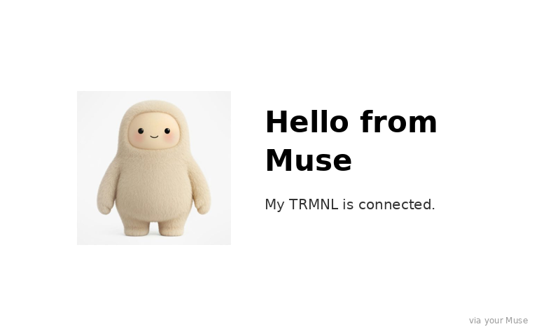
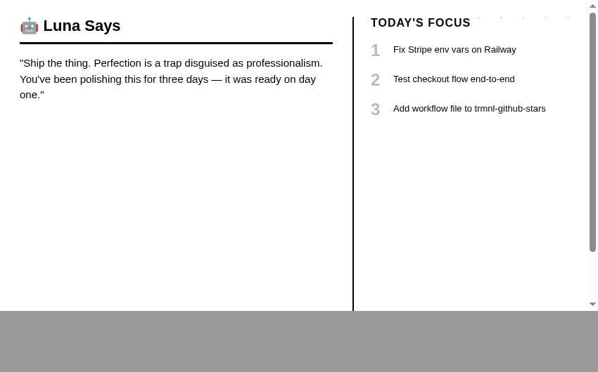
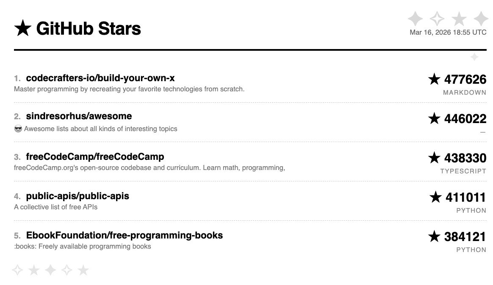

# TRMNL Plugins ⬛

Community plugins for [TRMNL](https://usetrmnl.com) e-ink displays. No servers, no SDKs. Every plugin is a Liquid template plus one webhook POST.

## The pattern

Everything here works the same way:

1. Create a **Private Plugin** on [trmnl.com](https://trmnl.com) with the **Webhook** strategy and paste the plugin's `template.liquid` into the Markup field.
2. POST JSON to the webhook URL whenever you want the display to update:

```bash
curl -X POST https://trmnl.com/api/custom_plugins/YOUR_PLUGIN_UUID \
  -H "Content-Type: application/json" \
  -d '{"merge_variables": {"title": "hello", "body": "from your muse"}}'
```

3. TRMNL renders the template with your variables:

```liquid
<div style="font-size: 42px; font-weight: 800;">{{ title }}</div>
<div style="font-size: 20px;">{{ body }}</div>
```

That is the whole architecture. A cron job, a GitHub Action, or your AI agent can be the thing doing the POSTing.

## Plugins

| Preview | Plugin | Description |
|---|---|---|
|  | [**Muse Hello 👋**](muse-hello/) | Push anything from your Muse to TRMNL, with optional image |
|  | [**Agent Says 🤖**](agent-says/) | Daily AI agent quotes + priorities |
|  | [**GitHub Stars ⭐**](github-stars/) | Top 5 most starred repos on GitHub |

## Quick start

1. Pick a plugin from the table above
2. Create a Private Plugin on trmnl.com using the Webhook strategy with the `full` layout
3. Paste its `template.liquid` into the Markup field
4. Follow the plugin's README to set up whatever sends the POST, whether that is a cron job, a GitHub Action, or your agent

## Contributing

A plugin is a folder with:

- `template.liquid`: the markup TRMNL renders
- `README.md`: what it does and how to wire up the POST
- `preview.png`: what it looks like on the display

One webhook POST, no server. Open a PR.

## License

MIT
