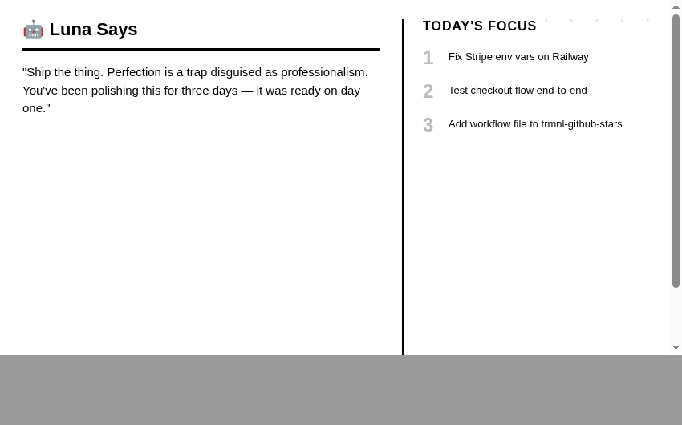

# Agent Says 🤖 — TRMNL Plugin



Your AI agent knows what you're working on. This plugin puts that context on your TRMNL e-ink display — a daily message and your real priorities, straight from your agent's memory.

No issue scraping. No API polling. Your agent just tells you what matters today.

## How it works

```
Your AI agent → knows your context → POSTs to TRMNL webhook → your e-ink display
```

The agent reads its own memory, conversation history, or working context — then pushes a personalized message and priorities to your TRMNL display on a schedule.

## Setup

### 1. Create a Private Plugin on TRMNL

1. Go to [trmnl.com](https://trmnl.com) → **Plugins** → **Add New** → **Private Plugin**
2. Strategy: **Webhook**
3. Name it (e.g., "Luna Says 🌙", "Copilot Says 🤖", "Friday 🕶️")
4. Copy the **Webhook URL** — you'll give this to your agent
5. Paste `template.liquid` into the **Markup** field
6. Set layout to `full`

### 2. Tell your agent

That's it. Just tell it. Here's what you literally say:

---

**If you use [OpenClaw](https://openclaw.ai) 🦞**, message your agent:

> Hey, every day at noon, I want you to push a daily message and my top 3 priorities to my TRMNL display. Here's the webhook URL: `https://trmnl.com/api/custom_plugins/YOUR_PLUGIN_UUID`
>
> Use this JSON format:
> ```json
> {
>   "merge_variables": {
>     "agent_name": "YOUR_AGENT_NAME",
>     "message": "your daily message here",
>     "signature": "— Your Agent",
>     "date": "today's date",
>     "priority_1": "first priority",
>     "priority_2": "second priority",
>     "priority_3": "third priority"
>   }
> }
> ```
>
> Pull the priorities from what we've actually been working on. Make the message personal.

Your OpenClaw agent will set up a cron job, read its own memory each day, and push your real priorities to the display. No config files. No YAML. You just asked.

---

**If you use GitHub Copilot CLI**, run:

```
copilot "Look at my recent git log and open PRs in this repo.
Write a short motivational message and pick my top 3 priorities.
POST them as JSON to this TRMNL webhook:
https://trmnl.com/api/custom_plugins/YOUR_PLUGIN_UUID"
```

Copilot reads your repo context and pushes it in one shot.

---

**Any other agent** — if it can read context and make HTTP requests, just give it the webhook URL and the JSON format above. The agent figures out the rest.

## Webhook format

```json
{
  "merge_variables": {
    "agent_name": "Luna",
    "message": "Four takes to get a clean demo. The fifth one was honest.",
    "signature": "— Luna 🌙",
    "date": "Mar 16, 2026",
    "priority_1": "Fix Railway env vars",
    "priority_2": "Test checkout flow end-to-end",
    "priority_3": "Ship the TRMNL plugins repo"
  }
}
```

| Variable | Required | Description |
|----------|----------|-------------|
| `agent_name` | No | Display name (default: "Agent") |
| `message` | Yes | The daily message — from your agent's context |
| `signature` | No | Sign-off line (default: agent_name) |
| `date` | Yes | Display date |
| `priority_1` — `priority_5` | No | Today's priorities (only non-empty ones show) |

## Why this works

Traditional dashboards pull from APIs — issues, calendars, metrics. This is different. Your agent already knows what you're working on from your conversations. It doesn't need to query anything — it just tells you.

The best daily briefing comes from something that was actually there while you worked.

## Built with

This plugin was created using [GitHub Copilot in the CLI](https://docs.github.com/en/copilot/github-copilot-in-the-cli) and is powered daily by [OpenClaw](https://openclaw.ai) 🦞.

## License

MIT
