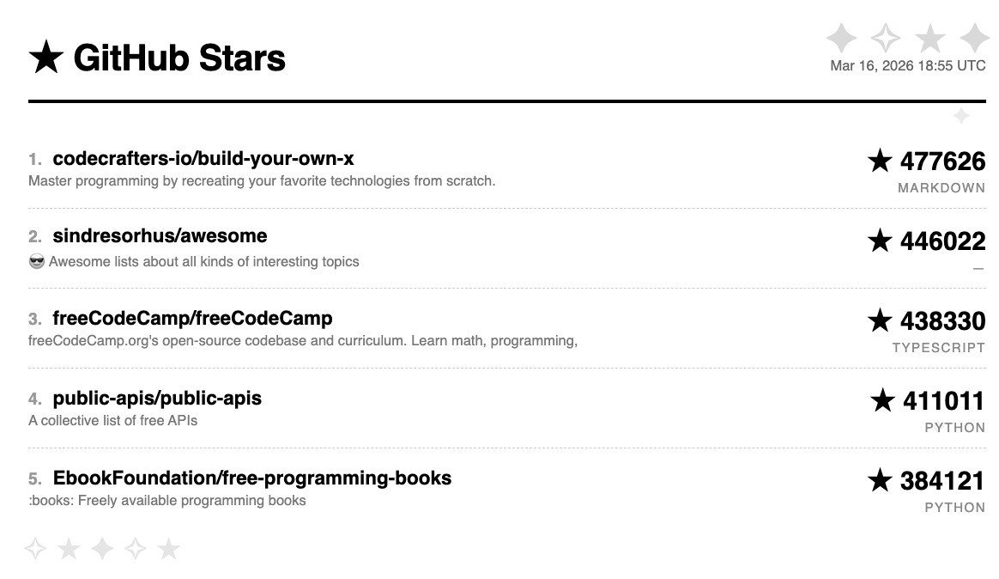

# GitHub Stars ⭐ — TRMNL Plugin

Show the most starred GitHub repos on your TRMNL e-ink display. No server needed — runs entirely via GitHub Actions.

## Setup

### 1. Create a Private Plugin on TRMNL

1. Go to [trmnl.com](https://trmnl.com) → **Plugins** → **Add New** → **Private Plugin**
2. Strategy: **Webhook**
3. Name it "GitHub Stars ⭐"
4. Copy the **Webhook URL** — you'll need it in step 3
5. Paste the Liquid template from `template.liquid` into the **Markup** field
6. Set layout to `full`

### 2. Fork this repo

Fork it to your own GitHub account (keep it private if you prefer).

### 3. Add your webhook URL as a secret

1. Go to your fork → **Settings** → **Secrets and variables** → **Actions**
2. Add a new secret:
   - Name: `TRMNL_WEBHOOK_URL`
   - Value: your webhook URL from step 1

### 4. Enable the GitHub Action

The Action runs daily at 10:00 AM UTC. You can also trigger it manually from the **Actions** tab.

## What it shows

- Top 5 most starred repos on GitHub (sorted by star count)
- Repo name, star count, and primary language
- Updated timestamp

## Customization

Edit `.github/workflows/push-stars.yml` to change:
- **Schedule**: modify the cron expression
- **Number of repos**: change `per_page=5`
- **Query**: change the search query (e.g., `created:>2026-01-01` for new repos only)

## Built with

This plugin was originally created using [GitHub Copilot in the CLI](https://docs.github.com/en/copilot/github-copilot-in-the-cli) — from the Liquid template to the GitHub Action workflow.

## License

MIT
